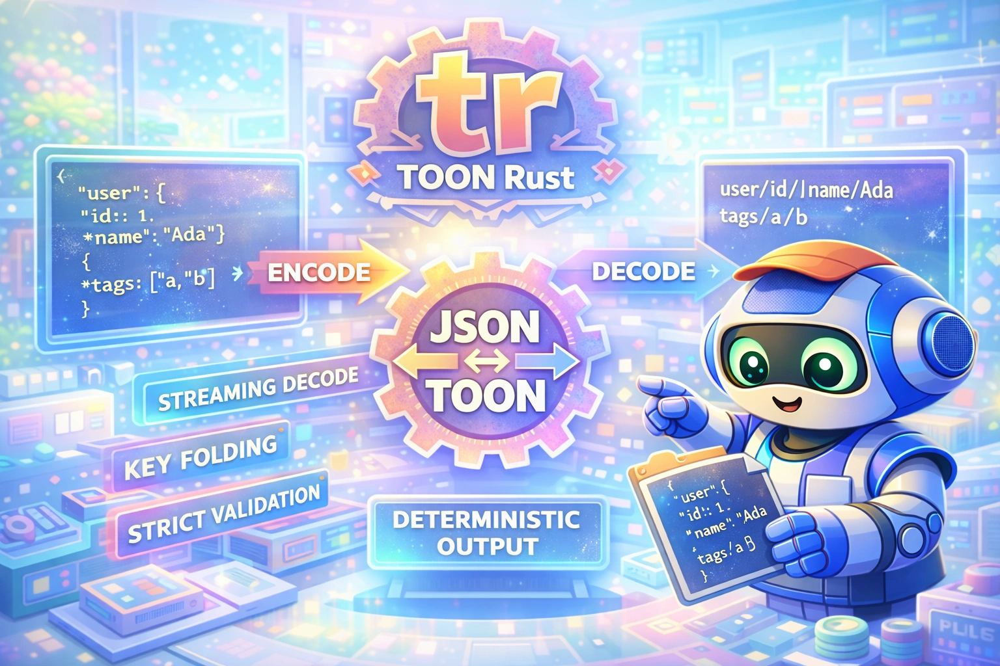

# tr - TOON Rust

<div align="center">
  
</div>

<div align="center">

[](https://github.com/Dicklesworthstone/toon_rust/actions/workflows/ci.yml)
[](https://opensource.org/licenses/MIT)
[](https://www.rust-lang.org/)
[](https://github.com/toon-format/spec)

</div>

Spec-first Rust port of TOON with deterministic output, strict validation, and token-efficiency options.

<div align="center">
<h3>Quick Install</h3>

```bash
curl -fsSL "https://raw.githubusercontent.com/Dicklesworthstone/toon_rust/main/install.sh?$(date +%s)" | bash
```

**Or build from source:**

```bash
cargo install --git https://github.com/Dicklesworthstone/toon_rust
```

<p><em>Works on Linux, macOS, and Windows. Production-ready with 100% spec conformance.</em></p>
</div>

---

## TL;DR

### The Problem
The official TOON implementation is TypeScript/JavaScript. If you want a small, fast, native binary that runs without Node and supports streaming and strict validation, you need a Rust port that matches the spec exactly.

### The Solution
`tr` is a spec-first Rust implementation with streaming decode, deterministic output, and TOON-specific optimizations (delimiters, key folding, path expansion).

### Why Use `tr`?

| Feature | Why it matters |
| --- | --- |
| Spec-first parity | Matches the reference behavior, not a re-interpretation |
| Streaming decode | Process large TOON inputs without full buffering |
| Deterministic output | Stable diffs, reproducible pipelines |
| Token efficiency | Delimiters + key folding to minimize tokens |
| Native binary | No runtime dependency on Node |

---

## What is TOON?

**TOON** (Token-Optimized Object Notation) is a human-readable data serialization format designed specifically for LLM token efficiency. Where JSON uses braces, brackets, quotes, and colons liberally, TOON uses indentation and contextual structure to convey the same information with significantly fewer tokens.

### The Token Problem

When working with LLMs, every token counts:
- **Cost**: API pricing is per-token
- **Context window**: More data = less room for conversation
- **Latency**: Fewer tokens = faster responses

JSON is notoriously token-inefficient. A simple object like `{"name": "Alice", "age": 30}` requires quotes around every key, colons, commas, and braces. TOON represents the same data as:

```
name: Alice
age: 30
```

### TOON Format at a Glance

```
# Primitives - just the value
Hello World
42
true
null

# Objects - indented key-value pairs
user:
  id: 1
  name: Alice
  email: alice@example.com

# Arrays - count in brackets, items indented with dash
tags[3]: red,green,blue

# Tabular arrays - header declares fields, rows are CSV-like
users[3]{id,name,active}:
  1,Alice,true
  2,Bob,false
  3,Carol,true

# Key folding - nested single-key objects collapse
config.database.host: localhost
config.database.port: 5432
```

### Token Savings in Practice

| Data Type | JSON Tokens | TOON Tokens | Savings |
|-----------|-------------|-------------|---------|
| Simple object (5 fields) | ~25 | ~15 | 40% |
| Array of 10 strings | ~35 | ~15 | 57% |
| Tabular data (100 rows, 5 cols) | ~1500 | ~600 | 60% |
| Nested config (3 levels) | ~80 | ~40 | 50% |

The savings compound with data size. A 100KB JSON API response might compress to 40KB in TOON, saving thousands of tokens per request.

---

## Quick Example

### CLI Usage

```bash
# Encode JSON to TOON
echo '{"users":[{"id":1,"name":"Alice"},{"id":2,"name":"Bob"}]}' | tr

# Output:
# users[2]{id,name}:
#   1,Alice
#   2,Bob

# Decode TOON back to JSON
echo 'users[2]{id,name}:
  1,Alice
  2,Bob' | tr -d

# Output:
# {"users":[{"id":1,"name":"Alice"},{"id":2,"name":"Bob"}]}

# File-based with auto-detection
tr data.json -o data.toon    # .json -> encode
tr data.toon -o data.json    # .toon -> decode

# Show token savings
tr data.json --stats
# Token estimates: ~1250 (JSON) -> ~520 (TOON)
# Saved ~730 tokens (-58.4%)
```

### Library Usage

```rust
use toon_rust::{encode, decode};
use toon_rust::options::{EncodeOptions, KeyFoldingMode};

fn main() {
    // Simple encode
    let json: serde_json::Value = serde_json::json!({
        "user": {"id": 1, "name": "Ada"},
        "tags": ["rust", "toon"]
    });
    let toon = encode(json.clone(), None);
    println!("{toon}");

    // Encode with options
    let options = EncodeOptions {
        key_folding: Some(KeyFoldingMode::Safe),
        flatten_depth: Some(4),
        ..Default::default()
    };
    let folded = encode(json, Some(options));

    // Decode back to JsonValue
    let decoded = decode(&toon, None);
}
```

---

## Performance

`tr` is designed for speed. The Rust implementation significantly outperforms the Node.js reference.

### Encode Benchmarks (hyperfine, 10 runs)

| Input Size | Node.js (toon) | Rust (tr) | Speedup |
|------------|----------------|-----------|---------|
| 336 B | 82 ms | 3 ms | **27x faster** |
| 144 KB (1.5K rows) | 92 ms | 11 ms | **8x faster** |
| 784 KB (5K rows) | 105 ms | 24 ms | **4x faster** |

### Decode Benchmarks

| Input Size | Node.js (toon) | Rust (tr) | Speedup |
|------------|----------------|-----------|---------|
| 379 KB TOON | 519 ms | 59 ms | **9x faster** |

### Resource Comparison

| Metric | Node.js (toon) | Rust (tr) | Improvement |
|--------|----------------|-----------|-------------|
| Startup time | 66 ms | 1.1 ms | **60x faster** |
| Memory (784KB encode) | 68 MB | 8 MB | **8x less** |
| Binary size | 608 KB + Node runtime | 681 KB standalone | No runtime needed |

### Token Compression

| Input Size | JSON | TOON | Reduction |
|------------|------|------|-----------|
| 336 B | 336 B | 191 B | 43% smaller |
| 144 KB | 144 KB | 67 KB | 53% smaller |
| 784 KB | 784 KB | 379 KB | 52% smaller |

### Why So Fast?

1. **Zero-copy parsing** where possible
2. **Pre-allocated buffers** based on input size estimation
3. **Reference-based key tracking** (no string cloning in hot paths)
4. **Direct string building** instead of format macros
5. **Streaming architecture** - process line-by-line without buffering entire input

---

## Design Philosophy

1. **Spec-first**: The spec doc is the source of truth, not translations.
2. **Streaming by default**: Encode and decode are designed for large inputs.
3. **Deterministic output**: Identical inputs produce identical TOON.
4. **Minimal dependencies**: Keep binaries small and fast.

---

## Comparison

| Tool | Runtime | Streaming | Spec fidelity | Notes |
| --- | --- | --- | --- | --- |
| `tr` (this repo) | Native | Yes | Target: full parity | Rust port of reference |
| `toon` (reference, TS) | Node | Yes | Yes | Canonical behavior |
| `jq` + custom format | Native | Partial | No | Not TOON-compatible |

---

## Installation

### One-liner install script
```bash
curl -fsSL "https://raw.githubusercontent.com/Dicklesworthstone/toon_rust/main/install.sh?$(date +%s)" | bash
```

### Cargo (from source)
```bash
cargo install --git https://github.com/Dicklesworthstone/toon_rust
```

### Build locally
```bash
git clone https://github.com/Dicklesworthstone/toon_rust
cd toon_rust
cargo build --release
./target/release/tr --help
```

---

## Quick Start

1. Build the binary:
   ```bash
   cargo build --release
   ```
2. Encode:
   ```bash
   cat input.json | ./target/release/tr --encode
   ```
3. Decode:
   ```bash
   cat data.toon | ./target/release/tr --decode
   ```

Note: CLI wiring is in progress; library APIs are production-ready for encode/decode.

---

## Command Reference

Target CLI (matches the reference tool):

```bash
tr [options] [input]
```

Auto-detection:
- `.json` -> encode
- `.toon` -> decode
- stdin defaults to encode unless `--decode` is provided

Common flags:
- `-o, --output <file>`
- `-e, --encode`
- `-d, --decode`
- `--delimiter <,|\\t|\\|>`
- `--indent <n>`
- `--no-strict`
- `--keyFolding <off|safe>`
- `--flattenDepth <n>`
- `--expandPaths <off|safe>`
- `--stats` (encode only)

---

## Configuration

There is no config file. All configuration is via CLI flags or library options:

```rust
use toon_rust::options::{EncodeOptions, KeyFoldingMode};

let options = EncodeOptions {
    indent: Some(2),
    delimiter: Some(','),
    key_folding: Some(KeyFoldingMode::Safe),
    flatten_depth: Some(usize::MAX),
    replacer: None,
};
```

---

## How It Works

### Encoding Algorithm

The encoder transforms JSON into TOON through a multi-phase pipeline:

```
JSON Input
    |
    v
[1. Normalize] - Convert serde_json::Value to internal JsonValue
    |
    v
[2. Classify] - Determine structure type for each value
    |           - Primitive: emit directly
    |           - Object: check for tabular or nested
    |           - Array: detect homogeneous, tabular, or mixed
    |
    v
[3. Fold Keys] - Apply key folding (if enabled)
    |           - Detect single-key chains: {a:{b:{c:1}}} -> a.b.c: 1
    |           - Validate no sibling conflicts
    |
    v
[4. Emit Lines] - Generate TOON output line-by-line
                - Track indentation depth
                - Format headers with counts and field lists
```

#### Tabular Array Detection

One of TOON's most powerful features is automatic tabular array formatting. The algorithm:

1. Check if array is non-empty and all elements are objects
2. Extract field names from the first object
3. Verify all objects have identical keys in the same order
4. Verify all values are primitives (no nested structures)
5. If all checks pass, emit as tabular with header

```json
// Input
[{"id":1,"name":"Alice","active":true},{"id":2,"name":"Bob","active":false}]

// Detection: All objects, same keys [id,name,active], all primitive values
// Output (tabular format)
[2]{id,name,active}:
  1,Alice,true
  2,Bob,false
```

#### Key Folding Algorithm

Key folding collapses nested single-key objects into dotted paths:

```
Input: {"config":{"database":{"host":"localhost"}}}

Algorithm:
1. Start at "config", value is object with 1 key
2. Descend to "database", value is object with 1 key
3. Descend to "host", value is primitive "localhost"
4. Collect path segments: ["config", "database", "host"]
5. Join with dots: "config.database.host"
6. Emit: config.database.host: localhost
```

Safety checks prevent folding when:
- A sibling key matches the folded path
- The path contains non-identifier characters
- Folding would exceed `flattenDepth`

### Decoding Algorithm

The decoder uses an event-based streaming architecture:

```
TOON Input (lines)
    |
    v
[1. Scanner] - Tokenize each line
    |         - Detect indentation level
    |         - Parse key, header, value components
    |
    v
[2. Parser] - Build event stream from tokens
    |        - Track nesting via indentation stack
    |        - Emit JsonStreamEvent for each structural element
    |
    v
[3. Event Builder] - Reconstruct JSON tree
    |               - Handle ObjectStart/End, ArrayStart/End
    |               - Expand dotted paths (if enabled)
    |
    v
[4. Path Expansion] - Convert dotted keys to nested objects
                    - "a.b.c: 1" -> {"a":{"b":{"c":1}}}
```

#### Event Types

```rust
enum JsonStreamEvent {
    ObjectStart,
    ObjectEnd,
    ArrayStart { length: usize },
    ArrayEnd,
    Key(String),
    Value(JsonPrimitive),
}
```

The streaming design allows processing arbitrarily large TOON files with constant memory overhead.

---

## Architecture

```
           +--------------------+
           |    CLI (tr)        |
           |  args + IO + stats |
           +---------+----------+
                     |
                     v
 +-------------------+-------------------+
 |          Core Library                 |
 |  encode: normalize -> folding -> emit |
 |  decode: scan -> parse -> events      |
 +-------------------+-------------------+
                     |
                     v
          +----------+-----------+
          |  Shared Utilities    |
          |  escaping + validation|
          +----------------------+
```

### Module Structure

```
src/
├── main.rs           # CLI entry point
├── lib.rs            # Public API exports
├── options.rs        # EncodeOptions, DecodeOptions
├── error.rs          # Error types
├── encode/
│   ├── mod.rs        # encode(), encode_lines()
│   ├── normalize.rs  # JSON normalization
│   ├── primitives.rs # Primitive encoding
│   ├── encoders.rs   # Object/array encoders
│   ├── folding.rs    # Key folding algorithm
│   └── replacer.rs   # Custom replacer support
├── decode/
│   ├── mod.rs        # decode(), decode_stream_sync()
│   ├── scanner.rs    # Line tokenization
│   ├── parser.rs     # Token -> event parsing
│   ├── decoders.rs   # Value reconstruction
│   ├── event_builder.rs  # Event stream builder
│   ├── expand.rs     # Path expansion
│   └── validation.rs # Strict mode validation
├── cli/
│   ├── mod.rs        # CLI orchestration
│   ├── args.rs       # clap argument definitions
│   ├── conversion.rs # Streaming encode/decode
│   ├── json_stream.rs    # Event -> JSON chunks
│   └── json_stringify.rs # JsonValue -> JSON string
└── shared/
    ├── mod.rs
    ├── constants.rs  # Format constants
    ├── string_utils.rs   # Escaping, quoting
    ├── literal_utils.rs  # Literal parsing
    └── validation.rs     # Key/value validation
```

---

## Troubleshooting

Common errors and fixes:

1. **Failed to parse JSON**  
   Ensure your input is valid JSON. Use `jq .` to validate before encoding.

2. **Tabs are not allowed in indentation**  
   Strict mode forbids tabs. Replace leading tabs with spaces or use `--no-strict`.

3. **Blank lines inside list/tabular arrays**  
   Strict mode disallows blank lines inside array blocks.

4. **Expected N list array items, but found more**  
   Declared array length in header must match items in strict mode.

5. **Path expansion conflict**  
   When expanding dotted keys, conflicts throw in strict mode. Use `--no-strict` or fix the input.

---

## Limitations

- Release binaries are not published yet (coming soon - see Installation section)
- Async streaming decode (`decode_stream`) is sync-only for now; async wrapper planned
- No WebAssembly build yet (planned for browser/edge deployment)

---

## FAQ

**Q: Is this a new format?**  
A: No. This is a spec-first port of TOON.

**Q: Does it match the reference implementation?**
A: Yes. Full spec conformance verified via fixture tests. CLI flags match the TypeScript reference exactly.

**Q: Does it stream?**  
A: Decode uses event streaming internally; CLI streaming output is implemented.

**Q: Why nightly Rust?**  
A: The project targets Rust 2024 with strict linting and nightly toolchain components.

**Q: Can I use this as a library?**  
A: Yes. The `encode` and `decode` APIs are stable and spec-driven.

---

## About Contributions

*About Contributions:* Please don't take this the wrong way, but I do not accept outside contributions for any of my projects. I simply don't have the mental bandwidth to review anything, and it's my name on the thing, so I'm responsible for any problems it causes; thus, the risk-reward is highly asymmetric from my perspective. I'd also have to worry about other "stakeholders," which seems unwise for tools I mostly make for myself for free. Feel free to submit issues, and even PRs if you want to illustrate a proposed fix, but know I won't merge them directly. Instead, I'll have Claude or Codex review submissions via `gh` and independently decide whether and how to address them. Bug reports in particular are welcome. Sorry if this offends, but I want to avoid wasted time and hurt feelings. I understand this isn't in sync with the prevailing open-source ethos that seeks community contributions, but it's the only way I can move at this velocity and keep my sanity.

---

## License

MIT. See [LICENSE](LICENSE).
